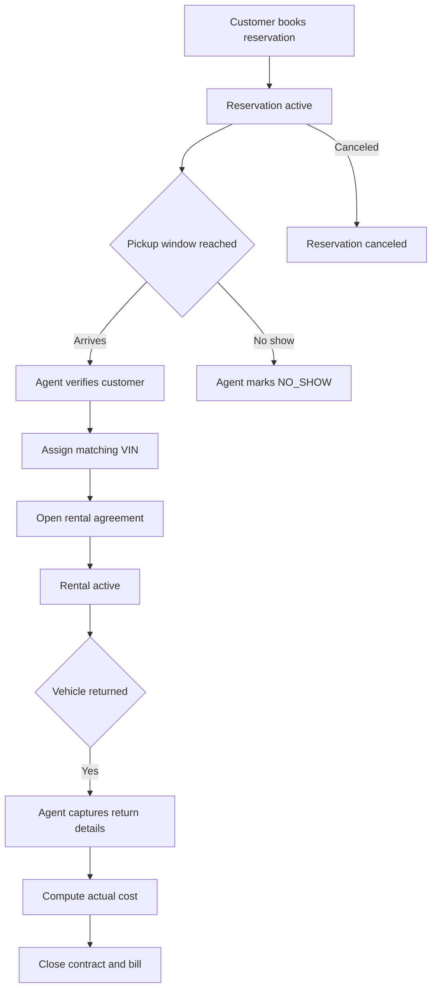

# BPMN Workflow Mapping

This document captures the mobile-first workflow model that now drives the role-based UI surfaces.

## Reservation To Return Workflow

## Role Mapping

| BPMN Stage | Owner | UI Surface | Primary API |
| --- | --- | --- | --- |
| Book Reservation | Customer | Customer Portal / Book | `POST /api/v1/customer-portal/bookings` |
| Reservation Active | Customer/System | Customer Portal / My Trip | `GET /api/v1/customer-portal/summary/{customer_id}` |
| Customer Intake | Agent | Agent Workspace / Intake | `POST /api/v1/customers` |
| Pickup Assignment | Agent | Agent Workspace / Pickup | `POST /api/v1/rental-agreements` |
| Rental In Progress | Customer + Manager | Customer Portal / My Trip, Manager / Overview | `GET /api/v1/dashboard/overview` |
| Return And Billing | Agent | Agent Workspace / Return | `PUT /api/v1/rental-agreements/{contract_no}` |
| Exception Handling | Agent + Manager | Agent / Return, Manager / Exceptions | `PUT /api/v1/reservations/{reservation_id}` |
| Fleet And Pricing Maintenance | Admin | Admin Console / Fleet + Pricing | `/api/v1/locations`, `/api/v1/car-classes`, `/api/v1/models`, `/api/v1/cars` |

## UI Visibility Rules

- Customers see only their booking and rental timeline.
- Agents see active work queues and guided transactional flows.
- Managers see branch health, overdue items, and blocked workflow cases.
- Rental Admins see configuration and inventory controls, plus workflow governance visibility.
