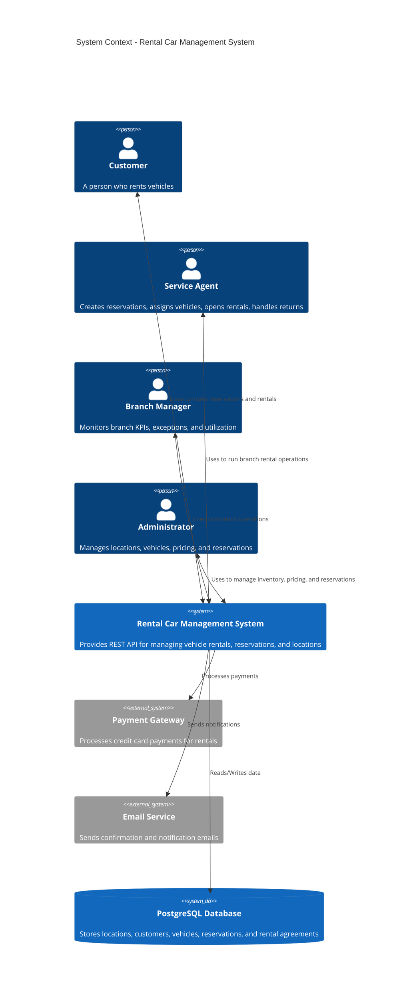
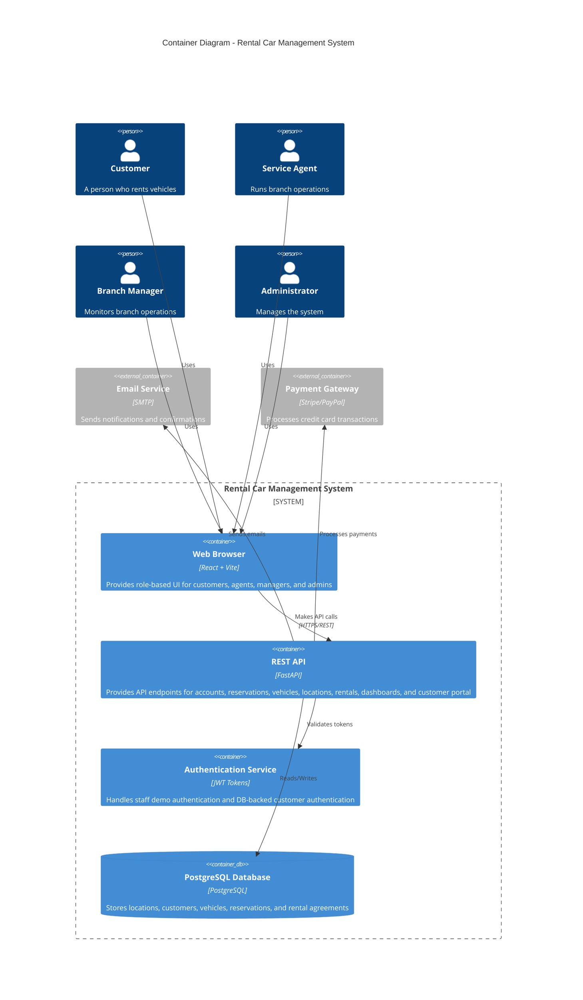
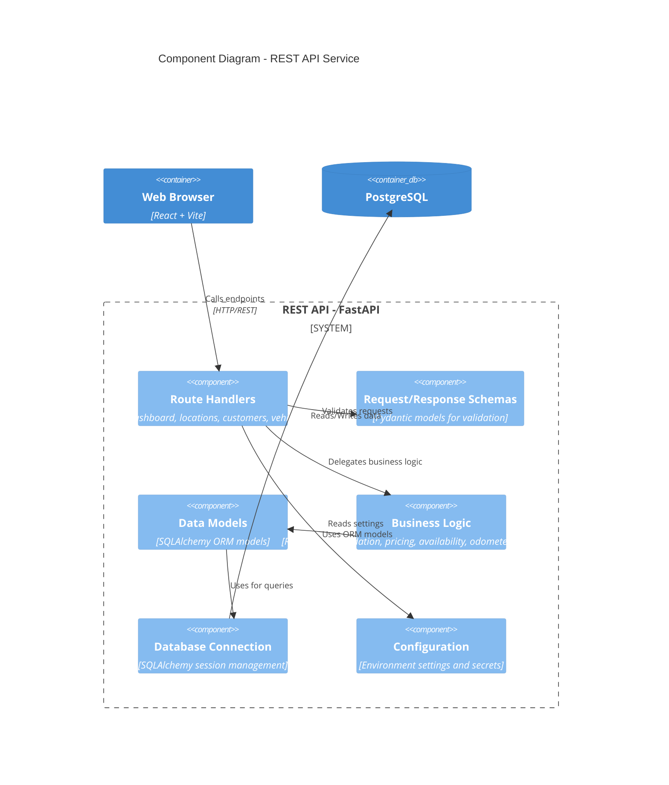
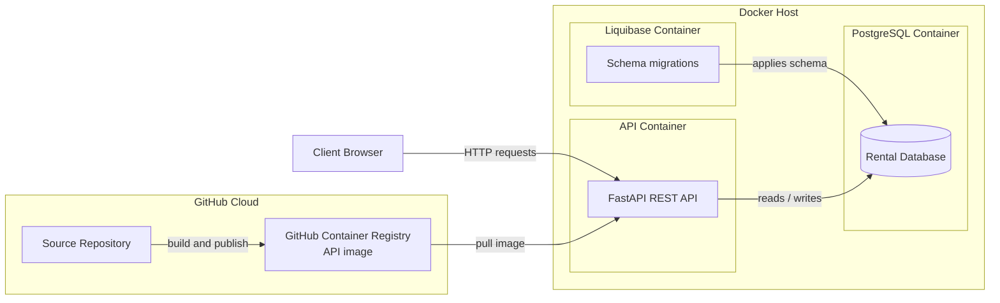

# C4 Architecture Diagrams - Rental Car Management System

## System Context Diagram (Level 1)

Shows the overall system in the context of external systems and users.

## Container Diagram (Level 2)

Shows the high-level structure of the system and internal containers.

## Component Diagram (Level 3)

Shows the major components within the FastAPI REST API.

## Deployment Diagram (Level 4)

Shows how the system is deployed in production.

