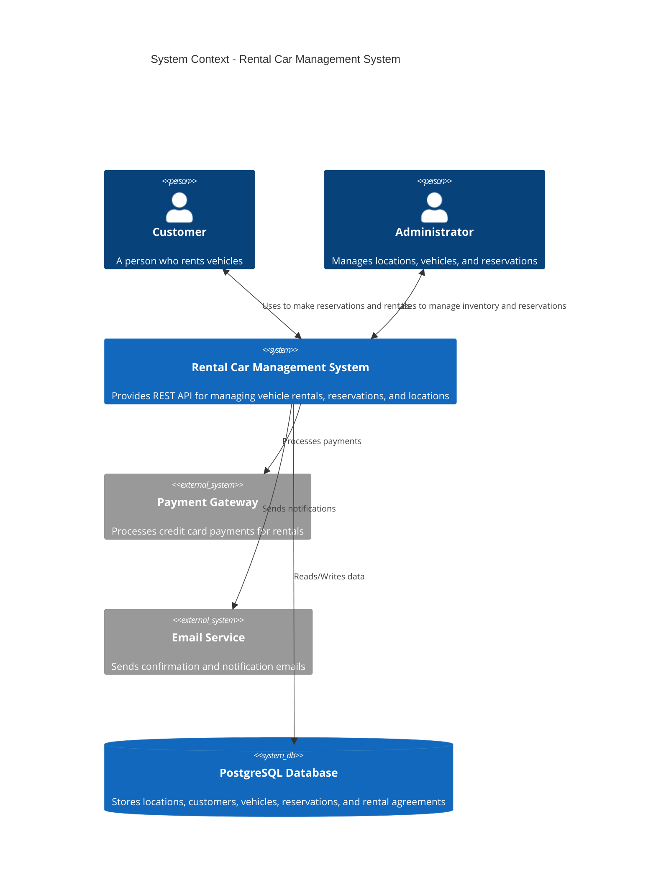
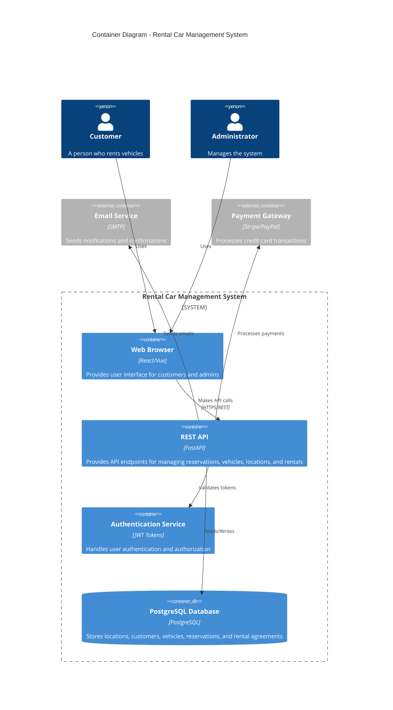

# C4 Architecture Diagrams - Rental Car Management System

## System Context Diagram (Level 1)

Shows the overall system in the context of external systems and users.



## Container Diagram (Level 2)

Shows the high-level structure of the system and internal containers.



## Component Diagram (Level 3)

Shows the major components within the FastAPI REST API.


## Deployment Diagram (Level 4)

Shows how the system is deployed in production.

```mermaid
C4Deployment
    title Deployment Diagram - Production Environment
    
    Deployment_Node(docker, "Docker Host", "Linux Server with Docker Engine") {
        Deployment_Node(postgres, "PostgreSQL Container", "PostgreSQL 15") {
            ContainerDb(db, "Rental Database", "PostgreSQL")
        }
        Deployment_Node(api, "API Container", "FastAPI Application") {
            Container(fastapi, "REST API", "FastAPI Framework")
        }
        Deployment_Node(liquibase, "Liquibase Container", "Schema Migration", "One-shot migrator") {
            Container(migration, "Database Migrations", "Liquibase XML Scripts")
        }
    }
    
    Deployment_Node(github, "GitHub", "GitHub Cloud") {
        Deployment_Node(ghcr, "GitHub Container Registry (GHCR)", "Image Storage") {
            Container(image, "API Docker Image", "ghcr.io/ga424/cs631-termproject-api")
        }
    }
    
    Deployment_Node(client, "Client Machine", "End User Device") {
        Container(browser, "Web Browser", "Chrome/Safari/Firefox")
    }
    
    Rel(migration, db, "Applies schema")
    Rel(fastapi, db, "Reads/Writes")
    Rel(browser, fastapi, "HTTP Requests")
    Rel(ghcr, api, "Deploys image")
```
