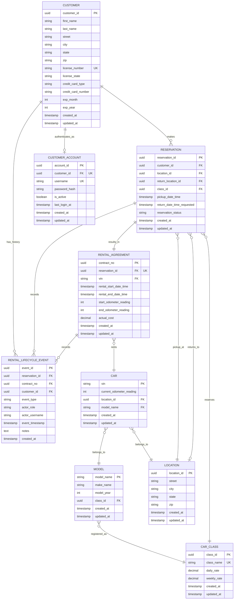

# Physical Data Model - Entity Relationship Diagram

## Rental Car Management System - Database Schema

## Schema Description

### Tables

| Table | Purpose | Primary Key | Key Constraints |
|-------|---------|-------------|-----------------|
| **LOCATION** | Branch/rental office locations | `location_id` (UUID) | Unique combination of street, city, state, zip |
| **CUSTOMER** | Customer profiles with license & payment info | `customer_id` (UUID) | Unique `license_number`, indexed for lookup performance |
| **CUSTOMER_ACCOUNT** | Customer login identity linked to one customer | `account_id` (UUID) | Unique `customer_id`, unique normalized `username`, active login flag |
| **CAR_CLASS** | Vehicle categories with rate cards | `class_id` (UUID) | Unique `class_name` (Economy, Compact, Mid-size, etc.) |
| **MODEL** | Specific vehicle models (make, model, year) | `model_name` (String) | Unique model name, FK to CAR_CLASS |
| **CAR** | Individual vehicles in fleet | `vin` (String) | Unique per vehicle, FK to LOCATION and MODEL; class is derived through MODEL |
| **RESERVATION** | Pre-bookings by customers | `reservation_id` (UUID) | Pickup location, optional different return location, requested class/date range |
| **RENTAL_AGREEMENT** | Actual rental contracts | `contract_no` (UUID) | Unique FK to RESERVATION; one rental per reservation |
| **RENTAL_LIFECYCLE_EVENT** | Durable trip audit history | `event_id` (UUID) | Reservation event type, actor role/username, timestamp, optional contract |

### Key Relationships

- **LOCATION** ↔ **CAR**: One location has many cars (stored at that location)
- **LOCATION** ↔ **RESERVATION**: One location services many reservations (pickup location)
- **CUSTOMER** ↔ **RESERVATION**: One customer makes many reservations
- **CUSTOMER** ↔ **CUSTOMER_ACCOUNT**: One customer has at most one login account
- **CUSTOMER** ↔ **RENTAL_LIFECYCLE_EVENT**: One customer has many lifecycle audit events
- **CAR_CLASS** ↔ **MODEL**: One car class has many models (e.g., "Economy" → "Toyota Corolla")
- **CAR_CLASS** ↔ **RESERVATION**: One class reserved many times
- **MODEL** ↔ **CAR**: One model defines many individual cars; cars do not store class directly
- **RESERVATION** → **RENTAL_AGREEMENT**: One-to-zero-or-one (active/canceled/no-show reservations may not have a rental contract)
- **RESERVATION** → **RENTAL_LIFECYCLE_EVENT**: One reservation has many lifecycle events
- **CAR** → **RENTAL_AGREEMENT**: One car can have multiple rental agreements over time

### Data Types

- **UUID**: Universally unique identifier (PostgreSQL `uuid` type)
- **STRING**: Variable-length text (VARCHAR)
- **DECIMAL**: Monetary values (10,2 precision)
- **TIMESTAMP**: Date and time with timezone
- **INTEGER**: Whole numbers (odometer readings, years)

### Audit Columns

All tables include:
- `created_at`: Timestamp when record was created
- `updated_at`: Timestamp of last update

### Indexes

- `customer.license_number`: Quick lookup by driver's license
- `car.location_id`: Quick retrieval of cars by location
- `car.model_name`: Query cars by model
- `reservation.customer_id`: Query reservations by customer
- `reservation.location_id`: Query reservations by location
- `reservation.class_id`: Query reservations by car class
- `reservation.reservation_status`: Filter by active/cancelled status
- `rental_agreement.reservation_id`: One-to-one lookup
- `rental_agreement.vin`: Query rentals by vehicle

### Business Rules

1. **Availability Check**: A car at a location is available if it is not in an open rental agreement.
2. **Agent Assignment**: Pickup assignment requires a car whose location matches the reservation pickup location and whose model belongs to the requested class.
3. **Class Governance**: Rates live on CAR_CLASS, models belong to exactly one class, and physical cars inherit class behavior through MODEL.
4. **Admin Integrity Feedback**: Duplicate class/model/VIN values and missing class/location/model references return `409 Conflict` API responses.
5. **Reservation Lifecycle**: `ACTIVE` reservations may become `FULFILLED`, `CANCELED`, or `NO_SHOW`; an open rental is active until the rental agreement has an end datetime.
6. **Pricing**: Cost is calculated using CAR_CLASS daily/weekly rates and rental duration unless an authorized closeout override is provided.
7. **Odometer Tracking**: start odometer is derived from the car record at pickup; end odometer is captured at return and updates the car record.
8. **Customer Ownership**: Customer JWTs can access only their own `/customer-portal/me` summary and booking data.
9. **Audit Trail**: Lifecycle events store who did what and when for reserved, canceled, no-show, picked-up, opened, returned, and billed steps.
10. **Payment Info**: Stored on CUSTOMER to simplify recurring rentals in the coursework/demo model.
