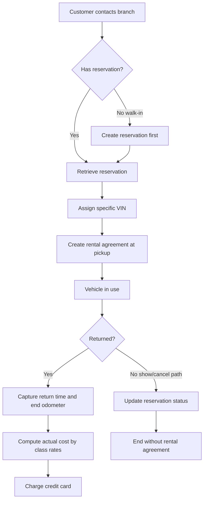
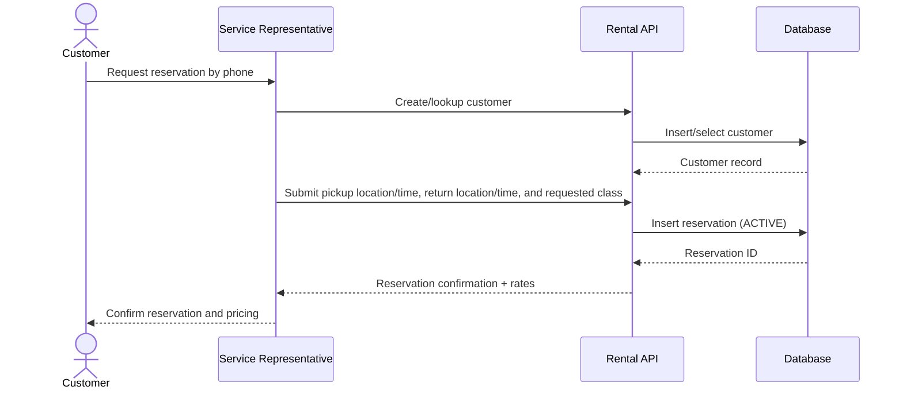
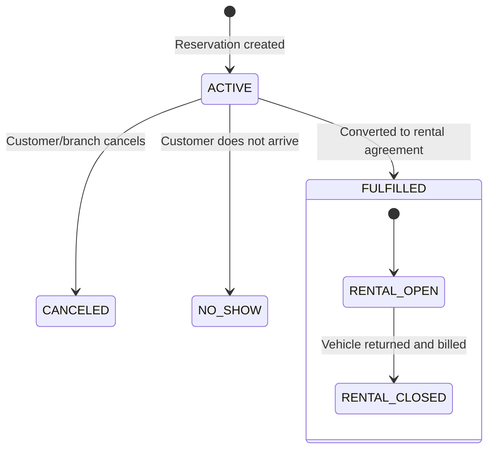

# User Journeys (CS631 RentACar Requirements Alignment)

This document maps user workflows directly to the official CS631 RentACar requirements and to the implemented API resources.

## Primary Personas And Authentication

- **Service Agent:** signs in with JWT credentials and handles customer intake, phone reservations, walk-ins, pickup rental agreements, cancellation/no-show updates, returns, and billing.
- **Branch Manager:** signs in with JWT credentials and reviews operational dashboard metrics for fleet availability, active rentals, overdue rentals, upcoming pickups, utilization, and rates.
- **Administrator:** signs in with JWT credentials and can perform all service-agent and manager workflows plus inventory/pricing administration for locations, car classes, models, and cars.
- **Customer:** signs in with a DB-backed customer account linked 1:1 to a customer row, then uses the self-service mobile portal to browse the catalog, place a reservation, and monitor reservation/rental status.

### Demo Credentials

- Customer: select an active seeded customer on the landing page or use `john.doe`, `jane.smith`, `robert.johnson`, `emily.williams`, or `michael.brown` with password `customer123`
- Agent: `agent` / `agent123`
- Manager: `manager` / `manager123`
- Admin: `admin` / `admin123`

Inactive no-booking customer accounts are visible for demo context but cannot log in. All `/api/v1/*` operational resources require `Authorization: Bearer <jwt>` except `/api/v1/auth/login`, `/api/v1/auth/customer-signup`, `/api/v1/auth/demo-customers`, `/`, `/health`, `/docs`, and `/api/v1`.

## Journey Views (Diagrams)

### End-To-End Journey Flow

### Phone Reservation Sequence

### Reservation And Rental Lifecycle States

`FULFILLED` means the reservation produced a rental agreement. It does not mean the customer has returned the vehicle. A customer-facing trip is still an active rental while the rental agreement has no `rental_end_date_time`.

## Journey 1: Reservation By Phone (Pre-Arrival)

### Requirement Mapping
- A customer makes a reservation for a **car class** at a **specific location**.
- The same customer may make multiple reservations over time.
- Reservation captures pickup location/date/time, return location/date/time, and desired class.

### Steps
1. Service representative captures customer identity and address.
2. Representative captures rental period and desired class.
3. System stores reservation in `reservation` with status `ACTIVE` and keeps return location separate from pickup location.
4. Customer is informed of daily/weekly class rates.

### Core Data
- `customer`, `location`, `car_class`, `reservation`

### API Touchpoints
- `POST /api/v1/customers`
- `GET /api/v1/locations`
- `GET /api/v1/car-classes`
- `POST /api/v1/reservations`

## Journey 2: Walk-In Customer (No Prior Reservation)

### Requirement Mapping
- Walk-ins are allowed, but all rentals must still be associated with a reservation.

### Steps
1. Representative creates reservation first (same interaction).
2. Reservation is then used to issue rental agreement.

### Core Data
- `customer`, `reservation`, `rental_agreement`

### API Touchpoints
- `POST /api/v1/customers` (if new)
- `POST /api/v1/reservations`
- `POST /api/v1/rental-agreements`

## Journey 3: Pickup And Rental Agreement Creation

### Requirement Mapping
- Reservation normally results in a rental agreement at pickup.
- Rental agreement must include unique contract number, specific VIN, start time, and start odometer.

### Steps
1. Representative retrieves reservation.
2. Specific vehicle (`vin`) is assigned.
3. The pickup odometer is confirmed from the selected car's stored `current_odometer_reading`.
4. Rental agreement is created, reservation becomes `FULFILLED`, and customer receives copy/keys.
5. Lifecycle audit events record who picked up and opened the rental, and when.

### Core Data
- `reservation`, `car`, `rental_agreement`

### API Touchpoints
- `GET /api/v1/reservations/{reservation_id}`
- `GET /api/v1/cars`
- `POST /api/v1/rental-agreements`

## Journey 4: Cancellation And No-Show

### Requirement Mapping
- Reservation may be canceled.
- Customer may not show up.
- In those cases, reservation does not produce a rental agreement.

### Steps
1. Reservation status is changed to `CANCELED` or `NO_SHOW`.
2. No contract is created for that reservation.

### Core Data
- `reservation`

### API Touchpoints
- `PUT /api/v1/reservations/{reservation_id}`

## Journey 5: Vehicle Return And Billing

### Requirement Mapping
- At return, end date-time and end odometer are recorded.
- Actual rental cost is computed from class rates and charged to credit card only.

### Steps
1. Representative opens rental agreement.
2. Start odometer is displayed from the contract; only the new return/end odometer is entered.
3. Actual cost is calculated and stored.
4. Billing is posted to customer credit card.
5. Car `current_odometer_reading` is updated to the submitted return odometer.
6. Lifecycle audit events record return and billing actor/timestamp details.

### Core Data
- `rental_agreement`, `reservation`, `car_class`, `customer`

### API Touchpoints
- `GET /api/v1/rental-agreements/{contract_no}`
- `PUT /api/v1/rental-agreements/{contract_no}`

## Journey 6: Inventory And Pricing Administration

### Requirement Mapping
- Cars are assigned to locations (each location has one or more cars).
- Car rates are controlled by class (daily and weekly).
- Models include make, model name, and year.

### Steps
1. Manage branch locations.
2. Manage class rates.
3. Manage model catalog by assigning each model to one class.
4. Register/update cars by selecting an existing location and model.
5. Confirm the class inherited by the selected model before saving a VIN.
6. Seed/demo data keeps at least two assignable vehicles per branch and bookable class, so agents can complete pickup assignments while the customer catalog can still show intentionally out-of-stock classes.

### Core Data
- `location`, `car_class`, `model`, `car`

### API Touchpoints
- `/api/v1/locations`
- `/api/v1/car-classes`
- `/api/v1/models`
- `/api/v1/cars`

### Integrity Rules
- `car_class.class_name`, `model.model_name`, and `car.vin` must be unique.
- `model.class_id` must reference an existing car class.
- `car.model_name` and `car.location_id` must reference existing records.
- Invalid references and duplicate keys return clear `409 Conflict` responses.

## Journey 7: Customer Self-Service Account And Trip History

### Requirement Mapping
- Customers can have login credentials tied to their customer identity.
- Customers can reserve a car class without being able to read or mutate another customer's data.
- The portal shows current trips and historical trips using reservation, rental agreement, billing, odometer, and lifecycle audit facts.

### Steps
1. Customer selects a seeded active customer account or registers a new account.
2. Customer signs in through the normal JWT login flow.
3. Customer opens My Trip, which defaults to trip history when reservations/rentals exist.
4. Customer opens the embedded reservation journey to select pickup/return location and time plus vehicle class.
5. Customer tracks lifecycle events: reserved, picked up, rental opened, returned, billed, canceled, or no-show.

### Core Data
- `customer`, `customer_account`, `reservation`, `rental_agreement`, `rental_lifecycle_event`

### API Touchpoints
- `POST /api/v1/auth/customer-signup`
- `GET /api/v1/auth/demo-customers`
- `POST /api/v1/auth/login`
- `GET /api/v1/customer-portal/catalog`
- `GET /api/v1/customer-portal/me`
- `POST /api/v1/customer-portal/bookings`

## Traceability To Project Phases

- **Phase I (Conceptual Design):** Journeys validate ER/EER entities, cardinalities, and participation.
- **Phase II (Database Design + Implementation):** Journeys map to tables, constraints, and endpoint behavior.
- **Phase III (Normalization, Testing, Demo):** Journeys define executable test scenarios and presentation scripts.
